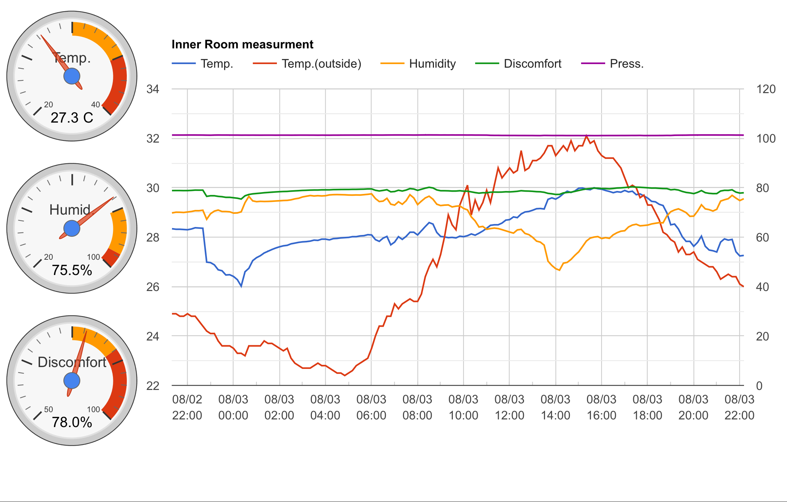

# LogMonitor

bme280センサから読み込んだ室温、湿度、気圧データをSQLiteデータベースに追加するPythonコードをcronで10分毎に実行。
外気温、湿度、大気圧データは気象ウェブサイトのデータをスクレイピングして、同じSQLiteデータベースに追加する。

SQLiteデータベースにアクセスしてグラフに表示したいデータをクエリで取り出してjsonデータとし書き出すphpコードは、グラフを描くhtmlから呼び出す。

グラフを描くhtmlファイルは、上記phpより出力されたjsonデータからグラフ表示するデータの列を作って、これをGoogle chartのLine chartで折れ線グラフを描く。これらの処理は1分毎に繰り返す連続ループ処理とする。SQLiteデータベースにデータが追加されると自動的にグラフがアップデートされる。SQLiteデータベースの追加はcronで10分毎に実行されているので、実際にグラフがアップデートされるのは10分毎である。

time stamp (センサデータ読み込み時の時刻)は文字列としてデータベースに書き込んでいたが、Google chartに渡された時刻データ(グラフの横軸データ)も文字列になるため、Google chartのオプションによるフォーマット処理が効かず、長々とした年月日時分秒の文字列が横軸上に並んでしまう。また数値データではないため、縦の罫線が描かれない。文字列の時刻データから　Date.parseを使って時刻数値に変換する方法があるが、Date.parseはブラウザにより挙動が異なるので使用は非推奨とのこと。実際、Chromeでは問題ないが、Safariではうまくいかないようだった。

SQLiteデータベースを作り直してtime stampはdatetime型に変更した。しかし、Chromeでは問題ないが、Safariではやはりうまくいかない。年月時刻データとして認識できていないようだ。SQLiteデータベースから取り出したtime stampの値は、  
  "2020-07-29 00:00:00.123456"  
といった形になるのだが、-(ハイフン)が入った年月日はSafariでは認識できないことがわかった。　timestamp.replace(/-/g,"/") とすることで　- を　/ に置き換えると良いという情報があり、試してみたが同じ。つぎに、timestamp.replace(/¥s/,"T") とすることで　スペース を　T に置き換えるとSafariでも読み込みが出来るようになった。しかしUTC時刻として評価されるようで、9時間プラスされた時刻になってしまう。
pythonのdatetimeで作った時刻には小数点の付いた秒、すなわちミリ秒のデータも含まれてくるのだが、どうもこの小数点以下が原因らしい。"2020-07-29 00:00:00"の形にできないか。そこで考えたのが、python側の以下のコードでtimestamp値を作ってみた。 

  currenttime = datetime.datetime.now().strftime('%Y/%m/%d %H:%M:%S') 
  timestamp = datetime.datetime.strptime(currenttime,'%Y/%m/%d %H:%M:%S')  

こうすると、currenttimeには　2020/07/29 00:00:00(文字列)が入り、timestampには　2020-07-29 00:00:00(datetime値)が入った。その結果、Safariでも年月時刻データとして認識できるようになった。但し、htmlで使うときに　- を　/ に置き換える　timestamp.replace(/-/g,"/")　の処置はやはり必要だ。
  

# 参考にした情報

Raspberry Piと温度湿度センサーを使って数値をグラフ化

http://mugimugi.hatenablog.com/entry/2014/07/20/Raspberry_Pi%E3%81%A8%E6%B8%A9%E5%BA%A6%E6%B9%BF%E5%BA%A6%E3%82%BB%E3%83%B3%E3%82%B5%E3%83%BC%E3%82%92%E4%BD%BF%E3%81%A3%E3%81%A6%E4%B8%8D%E5%BF%AB%E6%8C%87%E6%95%B0%E3%82%92%E3%82%B0%E3%83%A9%E3%83%95

------------------------------------      
store-sqlite.py

Raspberry PiでSQLiteに温度データを蓄えてみよう！

https://yuki-no-yabo.com/raspberry-pi-sqlite/

------------------------------------
Visualization: Gauge

https://developers.google.com/chart/interactive/docs/gallery/gauge
